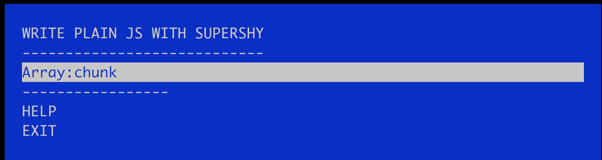

## 描述

learn-plain-js-with-supershy起源于我想提高自己的代码水平，闲暇时间没事自己造个轮子来练习算法、es6等等，而[*Lodash*](https://lodash.com/) 是一个具有一致接口、模块化、高性能等特性的JavaScript 工具库，这个练习是对照着它的api来实现的。

### 让我们开始吧

```javascript
npm install learn-plain-js-with-supershy -g
npm install mocha -g
```

当我们运行```learn-plain-js-with-supershy```会出现



上下键选择好后点击回车就出现了题目。